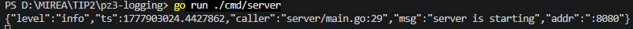
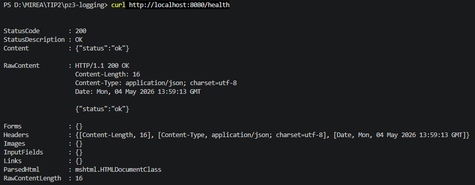
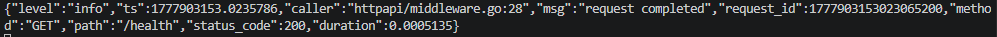
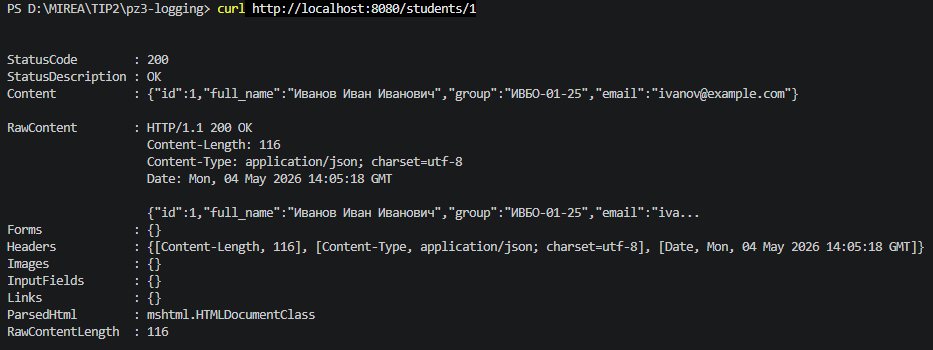
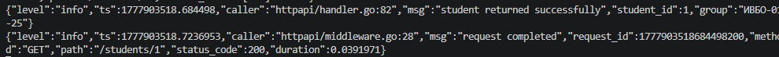
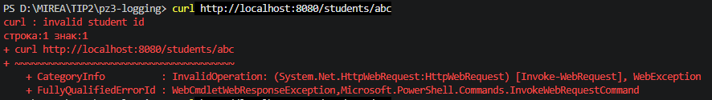
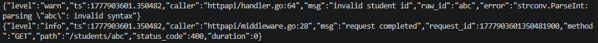
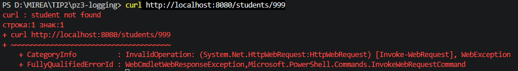
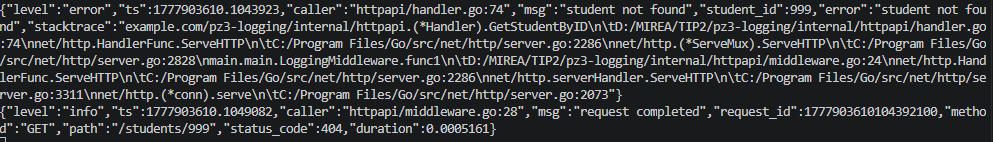
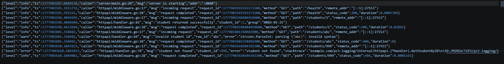

# Практическое занятие №3
# Логирование с помощью zap. Ведение структурированных логов

**Дисциплина:** Технологии индустриального программирования  
**Семестр:** 2, 2025-2026  
**Студент:** Синицын А.Г. ЭФМО-01-25

---

## Краткое описание проекта

Реализован HTTP-сервис на Go с двумя маршрутами:  
- `GET /health` – проверка работоспособности,  
- `GET /students/{id}` – получение студента по идентификатору.

В приложение интегрирована библиотека структурированного логирования **zap**. Логируются старт сервера, входящие запросы, завершение обработки (с кодом ответа и длительностью), а также ошибки валидации и отсутствия данных.  
В рамках дополнительного задания (Вариант 1) реализовано одновременное логирование в консоль и в файл `app.log`.

---

## Структура проекта
```
pz3-logging/
├── cmd/
│   └── server/
│       └── main.go
├── internal/
│   ├── httpapi/
│   │   ├── handler.go
│   │   ├── middleware.go
│   │   └── response_writer.go
│   └── student/
│       ├── model.go
│       └── repo.go
├── pkg/
│   └── logger/
│       └── logger.go
├── go.mod
└── app.log (появляется после запуска)
```
---

## Требования к проекту

- Go 1.21+
- Библиотека `go.uber.org/zap`
- Свободный порт 8080

---

## Результаты выполнения (скриншоты)

### Запуск сервера и логирование старта


### Успешный запрос /health и соответствующие логи



### Успешный запрос /students/1 и логи



### Ошибка 400 (неверный ID)



### Ошибка 404 (студент не найден)



### Содержимое файла app.log


---

## Ответы на контрольные вопросы

**1. Зачем backend-приложению нужно логирование?**  
Логи — основной инструмент наблюдаемости. По ним разработчик понимает, что происходило в приложении: какие запросы поступали, какие маршруты вызывались, где возникли ошибки и сколько времени заняла обработка. Без логов сопровождение серверного приложения практически невозможно.

**2. Чем обычный текстовый лог отличается от структурированного?**  
Обычный лог — это просто строка, которую сложно автоматически анализировать и фильтровать. Структурированный лог содержит сообщение, уровень важности и набор полей в формате ключ-значение, что позволяет легко искать, фильтровать и агрегировать события.

**3. Что означает structured logging?**  
Structured logging — подход, при котором каждая запись лога содержит не только текстовое сообщение, но и структурированные поля (severity level, attributes), что делает логи удобными для машинной обработки и анализа.

**4. Какие уровни логирования используются в этой работе?**  
Debug (отладочная информация), Info (нормальные рабочие события), Warn (отклонения, приложение продолжает работу) и Error (операция завершилась ошибкой). Именно эти уровни используются в zap и были продемонстрированы в коде.

**5. Почему полезно логировать HTTP-метод, путь и статус ответа?**  
Эти поля позволяют точно идентифицировать запрос и результат его обработки. По ним можно понять, какой маршрут был вызван, с каким методом, и чем ответил сервер, что критически важно для диагностики.

**6. Зачем в лог добавляют время выполнения запроса?**  
Длительность запроса — один из ключевых показателей производительности. Оно помогает выявлять медленные обработчики и узкие места в системе.

**7. Почему логирование ошибок должно содержать дополнительный контекст?**  
Контекст (например, student_id, raw_id) позволяет быстро понять, при каких входных данных произошла ошибка, и воспроизвести проблему. Без контекста сообщение об ошибке может оказаться бесполезным.

**8. В чём практическое преимущество zap?**  
Zap — быстрый, структурированный, уровневый логгер, оптимизированный для production-нагрузок. Он предоставляет удобное API для добавления полей, поддерживает SugaredLogger для простоты и Production-конфигурацию для продакшена.

**9. Что означает maintenance mode у logrus?**  
Logrus находится в режиме поддержки (maintenance mode). Это значит, что новые функции активно не разрабатываются, и проект больше не эволюционирует. Для новых проектов рекомендуются современные альтернативы, такие как zap или slog.

**10. Почему structured logging особенно важен для микросервисов и backend API?**  
В микросервисной архитектуре запросы проходят через множество сервисов. Структурированные логи позволяют связывать события по идентификаторам, фильтровать по сервисам, уровням, полям, что необходимо для распределённой трассировки и быстрой диагностики проблем.
